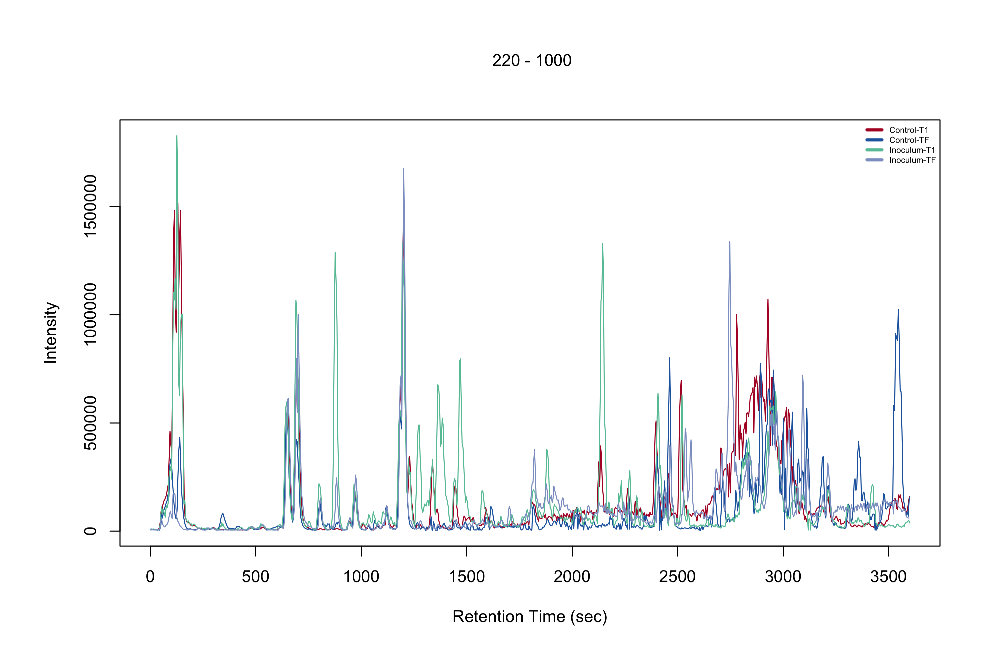
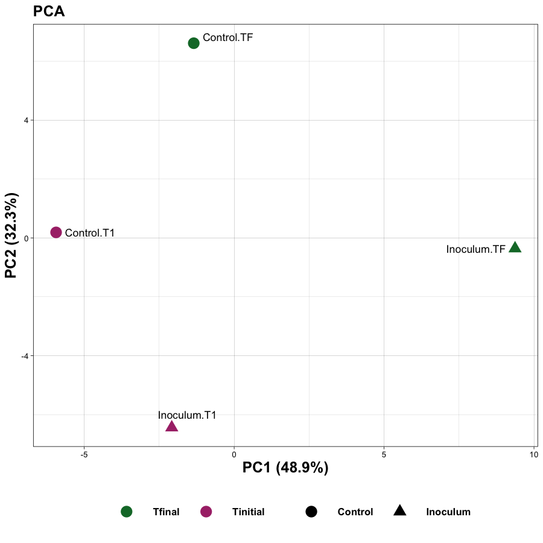
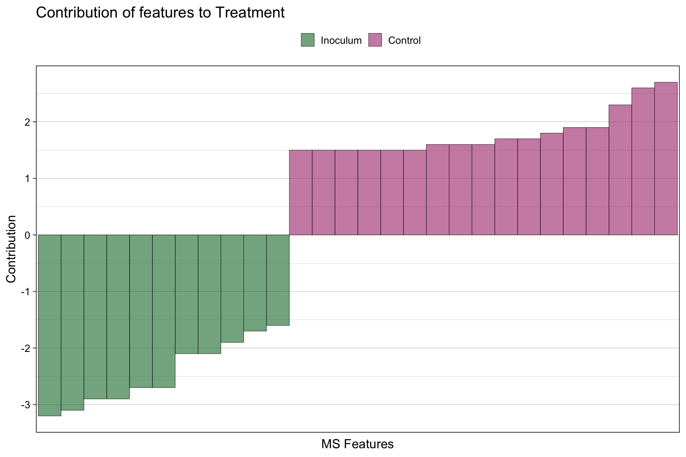
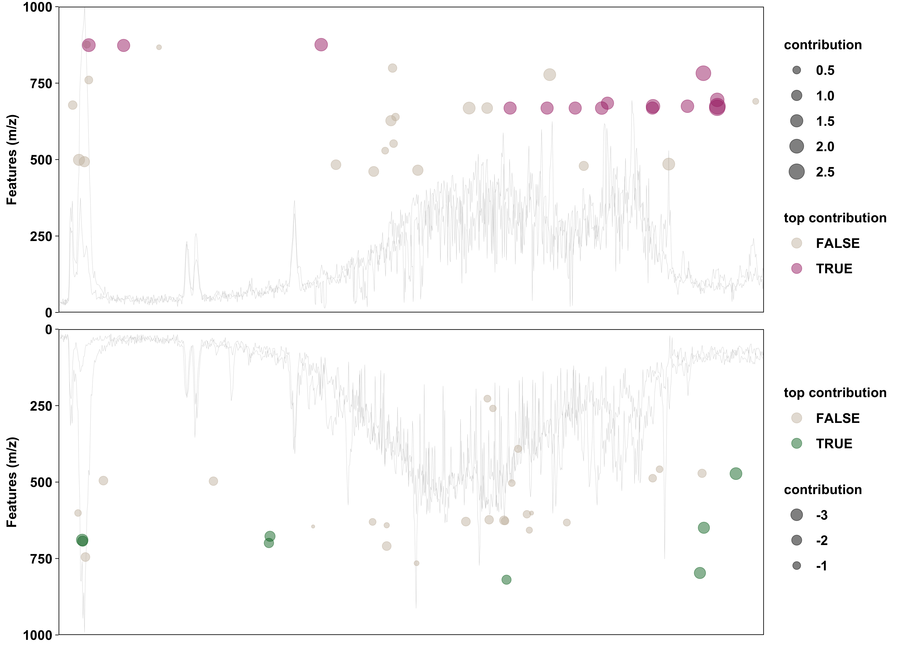

# Tandem Mass Spectrometry Data Analysis Tutorial

A brief tutorial on LCMS-MS data analysis using partial data from the *Sphagnum* experiment.

# Content

- [1 - Clone this repo](#1---clone-this-repo)
- [2 - Download data](#2---download-data)
- [3 - Analysis steps](#3---analysis_steps)
- [3.1 - Create metadata](#1---create-metadata)
- [3.2 - LCMS-MS preprocessing](#2---lcms---ms-preprocessing)
- [3.3 - Downstream analyses](#3---downstream-analyses)

---
## 1 - Clone this repo

Choose a directory for this tutorial, and:

```
$ git clone https://github.com/nathaliagg/sphagnum_tandemms.git

$ cd sphagnum_tandemms/
```

`sphagnum_tandemms/` is the tutorial directory.

---
## 2 - Download data

Go to our Basecamp project page, and download the LCMS-MS dataset (compressed file, `.zip`) from the Google Drive link. Make sure you move the file into the tutorial directory.

These data are a subset of the *Sphagnum* project. There are four samples: Control and Inoculum at two timepoints (Tinitial and Tfinal). When you uncompress the file, you should have a directory named `raw_data_mzxml` with those four files in it.

---
## 3 - Analysis steps

This is a brief tutorial on the data analysis process for tandem mass spec. data using [`xcms`](https://github.com/sneumann/xcms). The **main goal** is to introduce the LCMS-MS data **preprocessing** step, but I also included a few examples of downstream analyses one might need to perform.

### 1 - Create metadata

Create the [metadata or phenotypic data](./0_metadata/0_make_metadata.ipynb). This is just a table with file names, sample ids, treatments and timepoints.

### 2 - LCMS-MS preprocessing

You will most likely work with larger datasets than this one. I recommend importing the data as an `xcms OnDiskMSnExp` and saving it as an `.RData`  using [this script](./1_preprocessing/0_data_import.Rmd). Data import can take a few minutes, so this will be useful in case you'll need to redo your analysis from scratch.

After that, you can follow the directions in the [preprocessing script](./1_preprocessing/1_pre-processing.Rmd).

The preprocessing step is **super important**, and you should spend many hours staring at your own data, and testing different parameters. There is no "one-size-fits-all" approach when it comes to parameters you should use.


*This is the base peak chromatogram.*

### 3 - Downstream analyses

- Select MS2 features

Normally, I only work with the MS2 features that received an annotation (by either Sirius or GNPS). In this tutorial, we are not doing the annotation step, so I demonstrate how I would perform feature filtering [here](./2_stats/0_data_preparation.ipynb).

While you can choose to perform all downstream aanalyses with all features, I opt for the MS2 features because they carry the biological significance of the experiment.

- PCA

This is the script for the [PCA](./2_stats/0_PCA/0_PCA.Rmd), and you'll get the following output files:

```
./2_stats/0_PCA:
PCA_individual_coordinates.csv	     PCA_screeplot.png
PCA_cumulative_var.png		PCA_plot.png			PCA_vector_coordinates.csv
```


*This is the PCA plot.*

- PERMANOVA

This is the script for the [PERMANOVA](./2_stats/1_PERMANOVA/0_PERMANOVA.Rmd), and you'll get the following output files:

```
./2_stats/1_PERMANOVA:
features_contribution_Group_Treatment.csv       permanova_results.csv
Ft_Contribution_barplot.png
```


*This is the bar plot of feature contribution to Treatment. Each bar is a feature, and its value represent the contribution to a treatment (control, positive values, and inoculum, negative values).*

- Cloud plots

In the `./2_stats/1_PERMANOVA/`, we will also make the cloud plot using the feature contribution (output from PERMANOVA).

The original purpose of the cloud plot is to plot the differentially regulated metabolites (significantly up- or down-regulated), but this can also be done using the feature contribution from PERMANOVA.

First, run [this script](./2_stats/1_PERMANOVA/1_TIC_CloudPlots.Rmd) to obtain the TICs for the background, and then run [this script](./2_stats/1_PERMANOVA/2_CloudPlot_Treatment.Rmd) to make the cloud plot.



*What's a [cloud plot](https://pubs.acs.org/doi/10.1021/ac3029745)?*  
A cloud plot is a global representation of the mass spectrometry-based data. It displays the features that are significantly up- or down- regulated across sample groups. Each plot is organized with m/z on the y-axis and retention time along the x-axis. Each circle represents a feature, the diameter of the circle represents the log2 fold change (or the feature contribution in our case), the circles colored in grey were not significantly up- or down-regulated (or had low contribution), and the circles colored based on treatment showed significance (or high value for feature contribution).
